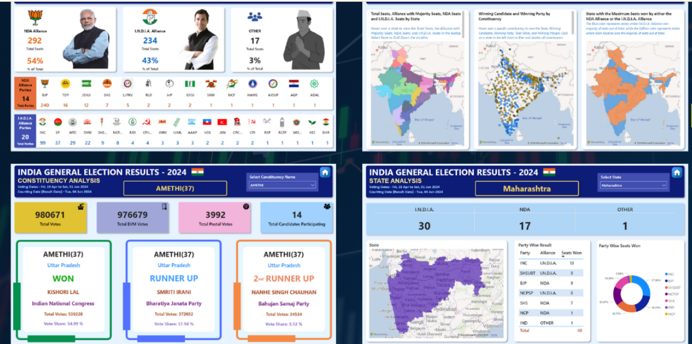

# India General Election Results 2024 Analysis
## 📁 Project Overview

This project analyzes the **India General Elections 2024 (Lok Sabha)** using real-world data across constituencies, states, and political alliances. It is designed to help political analysts, journalists, researchers, and data enthusiasts **understand electoral trends through interactive dashboards** and advanced SQL.

---

## 🗃️ Datasets Used

| File Name                      | Description                                                                 |
|-------------------------------|-----------------------------------------------------------------------------|
| `Constituency_Wise_Details.csv` | Candidate-level vote data (EVM, postal, total, percentage)                  |
| `Constituency_Results.csv`      | Constituency winners, party, margin                                         |
| `Party_Wise_Results.csv`        | Seats won by each party                                                    |
| `State_Wise_Results.csv`        | State-wise mapping of constituencies and candidates                        |
| `States.csv`                    | List of Indian states with IDs                                             |

---

## 🧱 ER Diagram & Data Modeling

The schema follows a **star model**:

- **Fact Table**: `Constituency_Results`
- **Dimension Tables**: `States`, `Party_Wise_Results`, `State_Wise_Results`, `Constituency_Wise_Details`

---

## 📊 Power BI Dashboards 

---

### 📌 **1. Overview Analysis**

Gain a bird’s eye view of **overall seat distribution** across alliances.

#### 🔑 KPIs:
- ✅ NDA: Total seats won, percentage share, grid view
- ✅ I.N.D.I.A.: Total seats won, percentage share, grid view
- ✅ Independents/Others: Total seats won, percentage share, grid view

#### 🔍 Visuals:
- Bar charts with alliance breakdown
- Bookmark-based toggle for details
- Party-wise seat distribution with **logos**

---

### 🗺️ **2. State Demographic Analysis**

Get a **state-wise overview** of election results using maps and drill-downs.

#### 🧮 Metrics:
- Total seats per state
- Alliance with majority seats
- NDA & I.N.D.I.A. seats by state

#### 🔍 Visuals:
- **Map charts** with tooltips
- Drill-through to state-level grid
- Bubble chart for **constituency-level winners**
  

---

### 🏞️ **3. Political Landscape by State**

Select a state to explore its **internal party dynamics** and alliance strength.

#### 📊 KPIs (Dynamic State Selection):
- Seats won by NDA
- Seats won by I.N.D.I.A.
- Seats won by Others

#### 📈 Charts:
- State map with colored constituencies
- Grid view of parties and alliances
- Donut chart for **party-wise seat share**

---

### 🗳️ **4. Constituency Analysis**

Zoom into a selected constituency for **candidate-level analysis**.

#### 🔑 KPIs:
- Total votes cast
- EVM votes
- Postal votes
- Number of candidates

#### 🥇 Winning Candidate:
- State, Candidate, Party, Total Votes, Vote Share

#### 🥈 Runner-Up Candidate:
- State, Candidate, Party, Total Votes, Vote Share

#### 🥉 Second Runner-Up Candidate:
- State, Candidate, Party, Total Votes, Vote Share

---

